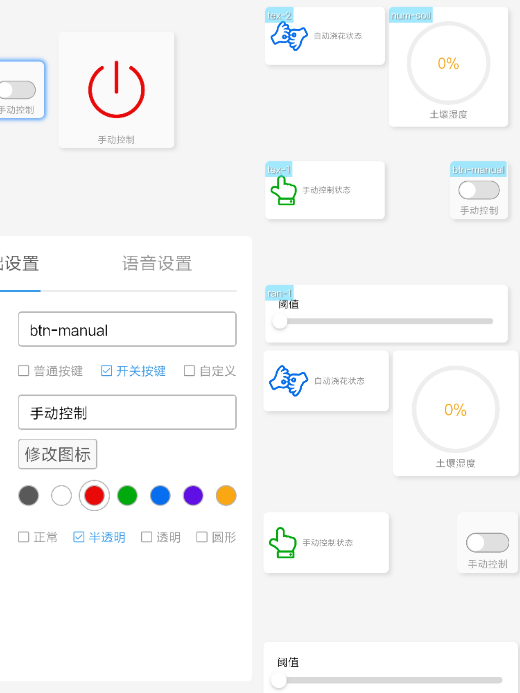

# flower care sys

## 基于arduino的物联网植物养护系统

**背景信息:**

这是一个开源的；基于arduino；基于blinker物联网平台；使用3D打印制作的一个浇花系统；

能够实现自动浇花，土壤水分检测，实时同步数据到手机端，手机端可以控制手动进行浇花

可以很容易的拓展多种传感器如温度传感器，空气湿度传感器，光照强度传感器，进行更加智能的杨虎

预计拓展场景：检测光强和温度，再夏日大太阳的时候，驱动电机自动遮光

空气湿度传感器，雨滴检测仪在下大雨天的时候自动遮雨

该项目的出发点是为了让女朋友喜欢上养花，做一个合格的花农，体会到养花所带来的乐趣。

小伙伴们有需要的可以拿去试试，希望你们玩的开心！

--provide by ylt  in hbut 2019.9.1--

## 零件清单

这个是在这个项目里你所需要的所有东西

* 1 x 7Pin0.96 SPI OLED 显示屏
* 1 x NodeMcu esp8266
* 1 x USB-A to micro-USB 数据线
* 12 x 杜邦线（公对公）
* 1 x 一位继电器
* 4 x 4位5号电池盒 带开关
* 3D 打印的外壳

**Tools:**

* 一些M3自攻螺丝

* 螺丝刀

* 电烙铁

  

## 3D 打印

* 推荐使用PLA打 我是用的打印机是ender3s
* 不需要使用支撑
* 填充率 20%

## 软件

所有的代码都在 WATEING_MACHINE.ino 文件中，使用arduino打开 编译下载即可

值得注意的是 ，必须先安装esp8266扩展，下载blinker库，下载u8g2库（OLED驱动），才能够正常编译

库文件的下载方式请自行搜索，

具体接入方法请查看blinke官方教程
 [使用esp8266](https://doc.blinker.app/?file=001-%E5%BF%AB%E9%80%9F%E5%BC%80%E5%A7%8B/02-esp8266%26WiFi%E6%8E%A5%E5%85%A5)

有任何blinker接口函数上的问题请查看

[blinker开发文档](https://doc.blinker.app)

接入流程 

开机 

**在Blinker APP 中 开发者>开发工具>EspTouch** 进行配网

输入自己的WIFI名称 密码 手机会自动将密码发送到设备上

在blinkerAPP中需要进行如下设置

- 拖入如图所示的控件
- 将数据键名改为如下（tex-2 , num-soil）等..
- 按钮控件需要将其切换为开关按键
- 文字说明可以自行修改

## 硬件电路

OLED

​      D5      >     MOSI

​      D7      >     SCK

​      D2      >     DC

​      D8      >     CS 

​      D3      >     RES

继电器

​      VCC      >     3V

​      GND      >     GND

​      SIG      >     D4

土壤湿度传感器

​      VCC      >     5V

​      GND      >     GND

​      SIG>     A0

## 组装提示

准备好螺丝刀可以省很多的事儿

检查好正负极再打开电源为了安全

## 谢谢!	